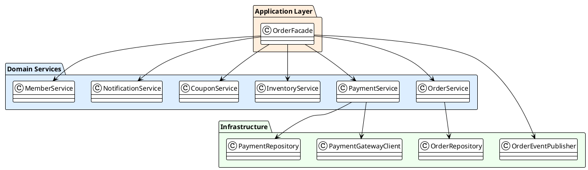
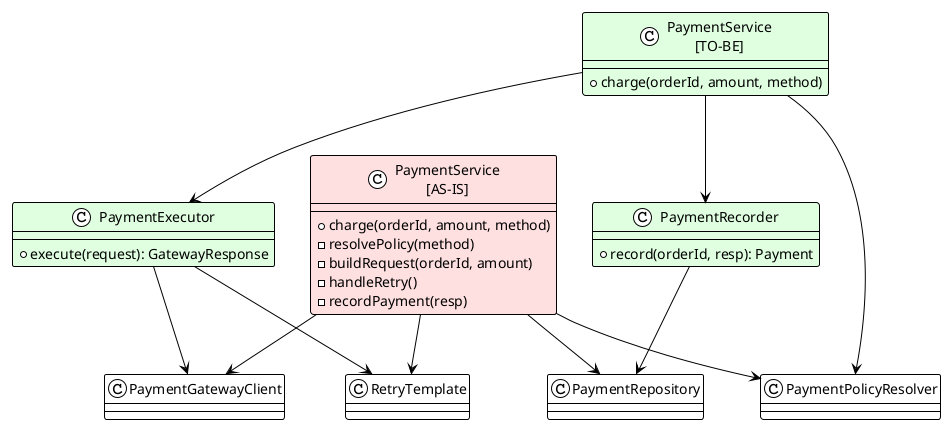

> 🔧 **Refactoring 도구 시리즈 · 1/3부** | ⏱ 읽는 데 약 12분 | 🏷 IntelliJ · PlantUML · Refactoring

# IntelliJ + PlantUML로 클래스 의존성 다이어그램 그리기

**코드 한 줄 바꾸기 전에, 먼저 지도부터 그려봅시다.**

---

## 목차

1. 왜 다이어그램이 필요한가 — "지도 없는 탐험"
2. 우리가 쓸 도구 두 가지: IntelliJ Diagram + PlantUML
3. 예제 코드 소개 — 주문 처리 시스템
4. IntelliJ 내장 다이어그램으로 빠르게 시각화하기
5. PlantUML로 원하는 뷰만 정밀하게 그리기
6. 두 도구를 언제, 어떻게 조합할까?
7. 마치며 — 다음 편 예고

---

## 1. 왜 다이어그램이 필요한가 — "지도 없는 탐험"

리팩토링을 시작하려는 순간, 이런 경험을 해본 적 있으신가요?

> *"여기 `OrderService`를 좀 분리해야겠는데... 근데 이게 어디랑 연결되어 있더라?"*

하고 **Find Usages**를 눌렀다가 수십 개의 참조가 쏟아지는 화면을 보며 조용히 파일을 닫는 그 느낌요. 😅

리팩토링에서 가장 큰 공포는 **"내가 이걸 바꾸면 얼마나 많은 게 깨질까?"** 인데, 이를 해소하는 가장 빠른 방법은 **클래스 간 의존성을 한눈에 보는 것**입니다. 텍스트로 된 코드만 들여다보는 건 마치 지도 없이 낯선 도시를 탐험하는 것과 같아요.

이번 글에서는 IntelliJ에 이미 내장된 다이어그램 기능과, 좀 더 세밀하게 그릴 수 있는 PlantUML 플러그인을 활용해서 **정적 클래스 의존성 다이어그램**을 그리는 방법을 소개할게요.

> ⚡ **이 글에서 다루는 것**
>
> 런타임에 어떤 순서로 메서드가 호출되는지(동적 흐름)는 **2부**에서 다룹니다.
> 여기서는 **컴파일 타임 의존 관계**, 즉 "A 클래스가 B를 참조하고 있는가"에만 집중합니다.

---

## 2. 우리가 쓸 도구 두 가지

| 도구 | 장점 | 단점 | 적합한 상황 |
|------|------|------|------------|
| **IntelliJ Diagram** (내장) | 별도 설치 불필요, 클릭 몇 번으로 즉시 생성 | 코드 문서로 저장·공유가 어려움, 커스터마이징 제한 | ✅ 빠른 탐색 |
| **PlantUML 플러그인** | 텍스트 기반 → Git 관리 가능, 원하는 클래스만 선택 가능 | 직접 코드를 써야 함 (자동화 X) | ✅ 팀 공유·문서화 |

두 도구는 경쟁 관계가 아닙니다. **IntelliJ로 전체 그림을 빠르게 파악한 뒤, PlantUML로 핵심 구조만 정리해 팀원들과 공유**하는 흐름이 가장 효과적이에요.

### PlantUML 플러그인 설치

아직 설치 안 하신 분들은 딱 1분이면 됩니다:

**① Plugins 열기**
`Preferences (⌘,)` → `Plugins` → Marketplace 탭으로 이동

**② "PlantUML Integration" 검색 후 Install**
작성 시점 기준 Mikhail Golubev 제작, 다운로드 2천만 회 이상의 메이저 플러그인입니다.

**③ Graphviz 설치 (macOS)**
```bash
brew install graphviz
```
렌더링 엔진입니다. Windows는 graphviz.org에서 설치.

**④ IDE 재시작**
이제 `.puml` 파일을 만들면 우측에 미리보기 패널이 열립니다. ✅

📸 *[스크린샷: Plugins Marketplace에서 "PlantUML Integration"을 검색한 화면. Install 버튼이 보이면 준비 완료!]*

---

## 3. 예제 코드 소개 — 주문 처리 시스템

실제 복잡성이 있는 코드를 봐야 다이어그램의 효용이 느껴지죠.
아래는 이커머스의 주문 처리 시스템입니다. `OrderFacade`가 여러 서비스를 오케스트레이션하고, 각 서비스는 다시 Repository · 외부 클라이언트 · 도메인 정책 객체를 참조합니다. 딱 봐도 "어디서부터 손을 대야 하지?" 싶죠. 😅

### ① 도메인 모델

```java
@Entity
@Table(name = "orders")
public class Order {

    @Id @GeneratedValue(strategy = GenerationType.IDENTITY)
    private Long id;

    @ManyToOne(fetch = FetchType.LAZY)
    private Member member;

    @OneToMany(cascade = CascadeType.ALL, orphanRemoval = true)
    private List<OrderItem> items = new ArrayList<>();

    @Enumerated(EnumType.STRING)
    private OrderStatus status;

    @Embedded
    private ShippingInfo shippingInfo;

    private LocalDateTime orderedAt;

    // 도메인 로직: 상태 전이 규칙을 Order 안에서 캡슐화
    public void cancel(CancellationPolicy policy) {
        policy.validate(this);
        this.status = OrderStatus.CANCELLED;
        items.forEach(OrderItem::restoreStock);
    }

    public Money calculateTotalPrice() {
        return items.stream()
            .map(OrderItem::getSubtotal)
            .reduce(Money::add)
            .orElse(Money.ZERO);
    }
}
```

### ② 애플리케이션 서비스 — 여기가 문제의 핵심입니다

```java
@Service
@RequiredArgsConstructor
public class OrderFacade {

    // 😱 이렇게 많은 의존성이 하나의 Facade에 모여 있으면
    //    다이어그램으로 보기 전까지 파악이 어렵습니다
    private final OrderService        orderService;
    private final PaymentService      paymentService;
    private final InventoryService    inventoryService;
    private final NotificationService notificationService;
    private final CouponService       couponService;
    private final MemberService       memberService;
    private final OrderEventPublisher eventPublisher;

    @Transactional
    public OrderResult placeOrder(PlaceOrderCommand command) {

        Member member = memberService.getOrThrow(command.getMemberId());
        CouponDiscount discount = couponService.applyIfPresent(
                command.getCouponCode(), command.getMemberId());

        inventoryService.reserveAll(command.getItems());

        Order order = orderService.create(member, command, discount);

        PaymentResult payResult = paymentService.charge(
                order.getId(), order.calculateTotalPrice(), command.getPaymentMethod());

        if (!payResult.isSuccess()) {
            inventoryService.releaseAll(command.getItems());
            couponService.rollback(command.getCouponCode());
            throw new PaymentFailedException(payResult.getErrorCode());
        }

        eventPublisher.publish(new OrderPlacedEvent(order));
        notificationService.sendOrderConfirmation(member, order);

        return OrderResult.from(order);
    }
}
```

```java
@Service
@RequiredArgsConstructor
public class PaymentService {

    private final PaymentGatewayClient  gatewayClient;  // 외부 PG사 HTTP 클라이언트
    private final PaymentRepository     paymentRepo;
    private final PaymentPolicyResolver policyResolver; // 결제수단별 정책 분기
    private final RetryTemplate         retryTemplate;

    @Transactional
    public PaymentResult charge(Long orderId, Money amount, PaymentMethod method) {
        PaymentPolicy policy = policyResolver.resolve(method);
        policy.validate(amount);

        return retryTemplate.execute(ctx -> {
            GatewayResponse resp = gatewayClient.requestCharge(
                    ChargeRequest.of(orderId, amount, method));
            Payment payment = paymentRepo.save(
                    Payment.of(orderId, resp));
            return PaymentResult.from(payment);
        });
    }
}
```

> 💡 **Tip**
>
> 이 정도 규모의 코드는 텍스트만 봐서는 "어떤 클래스가 어떤 클래스에 얼마나 의존하는지"를 직관적으로 파악하기 어렵습니다. 이제 이걸 그림으로 바꿔봅시다.

---

## 4. IntelliJ 내장 다이어그램으로 빠르게 시각화하기

### 방법 1: 패키지/클래스에서 우클릭 다이어그램 열기

**① Project 창에서 패키지를 선택**
`com.example.order` 패키지를 우클릭합니다.

**② Diagrams → Show Diagram 클릭**
`Diagrams` → `Show Diagram…`
단축키: `⌥⇧⌘U` (Windows: `Ctrl+Alt+Shift+U`)

**③ "Java Class Diagram" 선택**
IntelliJ가 패키지 내 클래스들을 분석해 즉시 다이어그램을 그려줍니다.

📸 *[스크린샷: IntelliJ Class Diagram 화면. `OrderFacade`에서 7개의 서비스로 뻗어나가는 의존 화살표가 한눈에 보입니다. 우상단 툴바에서 Fields / Methods / Show Dependencies 등을 토글할 수 있어요.]*

### 방법 2: 에디터에서 단일 클래스 다이어그램

특정 클래스 에디터를 열고 `⌥⇧⌘U`를 누르면 해당 클래스의 상속 계층 / 의존 관계를 바로 볼 수 있습니다. `OrderService` 하나만 집중해서 보고 싶을 때 유용해요.

### 다이어그램에서 의존성 필터링하기

패키지 전체를 보면 너무 복잡할 수 있습니다. 다이어그램 뷰에서:

- 클래스를 우클릭 → **Show Dependencies**: 선택한 클래스와 직접 연결된 것만 표시
- 툴바 눈 아이콘 → **Fields / Methods 토글**: 클래스 박스 크기 조절
- `Ctrl + 마우스 휠`: 줌 인/아웃
- 클래스를 그대로 드래그해서 레이아웃 재배치 가능

📸 *[스크린샷: `PaymentService`에서 "Show Dependencies"를 적용한 뒤, `PaymentGatewayClient` → `PaymentRepository` → `PaymentPolicyResolver` 세 방향으로만 의존이 뻗어 있음을 빠르게 확인하는 화면.]*

> 🔸 **IntelliJ 다이어그램의 한계**
>
> IntelliJ 내장 다이어그램은 `.xml` 형태로 저장되지만, Git에서 diff 보기가 사실상 불가능하고 팀원에게 공유하려면 스크린샷을 찍어야 합니다.
> "문서로 남기고 싶다"는 순간이 오면 PlantUML로 넘어갈 때입니다.

---

## 5. PlantUML로 원하는 뷰만 정밀하게 그리기

PlantUML은 텍스트로 다이어그램을 기술하는 DSL입니다.
`.puml` 파일을 프로젝트 `docs/diagrams/` 폴더에 넣으면 **코드 변경과 함께 다이어그램도 PR에서 리뷰**할 수 있게 됩니다. 🎉

### Step 1: 전체 의존성 뷰 — "지금 무슨 관계가 있나?"

먼저 IntelliJ 다이어그램에서 파악한 전체 구조를 PlantUML로 옮겨봅니다.
핵심 클래스들 간의 관계만 표현해도 충분히 유용해요.



📸 *[렌더링 결과: OrderFacade의 방사형 의존이 한눈에 보이는 다이어그램. Application / Domain Services / Infrastructure 세 영역으로 구분됩니다.]*

### Step 2: 리팩토링 타겟 클래스만 확대해서 보기

"전체 다이어그램은 너무 복잡하다"는 느낌이 들면, **리팩토링하려는 클래스와 1-hop 이내의 관계만** 뽑아서 별도 다이어그램을 만드세요.
아래는 `PaymentService` 리팩토링 전후를 비교하는 PUML입니다.



> 💡 **이 다이어그램의 가치**
>
> `PaymentService` 하나가 4개의 의존성을 직접 관리하던 것을 **책임 단위로 분리**(`PaymentExecutor`, `PaymentRecorder`)하면 각 클래스가 2개 이하의 의존성만 갖게 됩니다.
> PR에 이 다이어그램을 첨부하면 리뷰어가 의도를 훨씬 빠르게 파악할 수 있어요.

### Step 3: 인터페이스/추상화 레이어 표현

의존성 역전(DIP)을 적용할 때는 `interface`와 `implements` 관계를 명시하면 "왜 이 인터페이스가 필요한가"를 설명하기 훨씬 쉬워집니다.

```plantuml
@startuml payment-abstraction
!theme plain

interface PaymentGateway {
    +charge(request: ChargeRequest): GatewayResponse
    +cancel(paymentId: String): void
}

class TossPayGatewayClient implements PaymentGateway
class KakaoPayGatewayClient implements PaymentGateway
class StubPaymentGateway implements PaymentGateway #FFFFCC {
    -- 테스트용 --
}

PaymentExecutor --> PaymentGateway : "uses (DI)"

note right of PaymentExecutor
  PaymentGateway 인터페이스에만
  의존하므로 PG사 교체 시
  PaymentExecutor 수정 불필요
end note

@enduml
```

📸 *[스크린샷: IntelliJ 우측 PlantUML 미리보기 패널에서 `.puml` 파일을 저장하는 즉시 다이어그램이 실시간으로 렌더링되는 화면. 코드 좌측, 다이어그램 우측의 Split View.]*

---

## 6. 두 도구를 언제, 어떻게 조합할까?

실전에서 추천하는 워크플로우입니다:

**① IntelliJ 다이어그램으로 전체 스캔 (5분)**
리팩토링 대상 패키지를 우클릭 → Show Diagram. "어디가 복잡하지?"를 빠르게 파악합니다.

**② 문제 클래스를 PlantUML로 정밀 묘사 (20분)**
`docs/diagrams/before/`에 현재 상태를 PUML로 기록합니다. 이게 나중에 "before" 증거가 됩니다.

**③ TO-BE 다이어그램을 먼저 그리기**
`docs/diagrams/after/`에 목표 구조를 그립니다. 코드 작성 전에 팀원과 구조를 합의할 수 있어요.

**④ PR에 두 다이어그램을 나란히 첨부**
리뷰어는 "왜 이렇게 바꿨는지"를 코드보다 다이어그램으로 훨씬 빠르게 이해합니다.

> 🏆 **Best Practice**
>
> `docs/diagrams/` 폴더를 프로젝트에 추가하고, 아키텍처 변경이 있을 때마다 PUML 파일을 함께 수정하는 것을 팀 컨벤션으로 정해보세요.
> **다이어그램이 코드와 함께 버전 관리된다**는 것만으로도 온보딩 비용이 크게 줄어듭니다.

---

## 7. 마치며 — 다음 편 예고

오늘 살펴본 것을 정리하면:

- **IntelliJ 내장 다이어그램**: 클릭 몇 번으로 **전체 의존성을 빠르게 탐색**
- **PlantUML**: 텍스트로 다이어그램을 작성해 **Git으로 관리하고 팀과 공유**
- **두 도구의 조합**: 탐색(IntelliJ) → 정제(PlantUML) → 공유(PR) 플로우

클래스 의존성 다이어그램은 **"이 코드의 지형도"** 입니다. 리팩토링을 시작하기 전에 지형도를 그리는 습관을 들이면, "이걸 바꿨더니 저기가 터졌어요"의 당혹감을 상당히 줄일 수 있어요.

**2부**에서는 클래스 내부로 더 들어가서, 메서드들이 런타임에 어떤 순서로 호출되는지를 파악하는 **SequenceDiagram 플러그인 + Call Hierarchy**를 다뤄볼게요. "이 로직이 왜 이 순서로 실행되는 거지?" 싶을 때 딱 필요한 도구들입니다. 🚀

---

| | 제목 |
|--|------|
| **1부** ✅ | IntelliJ + PlantUML로 클래스 의존성 다이어그램 그리기 |
| **2부** 예정 | SequenceDiagram + Call Hierarchy로 동적인 로직 흐름 파악하기 |
| **3부** 예정 | IntelliJ DSM으로 패키지 간 순환 참조 분석하기 |
